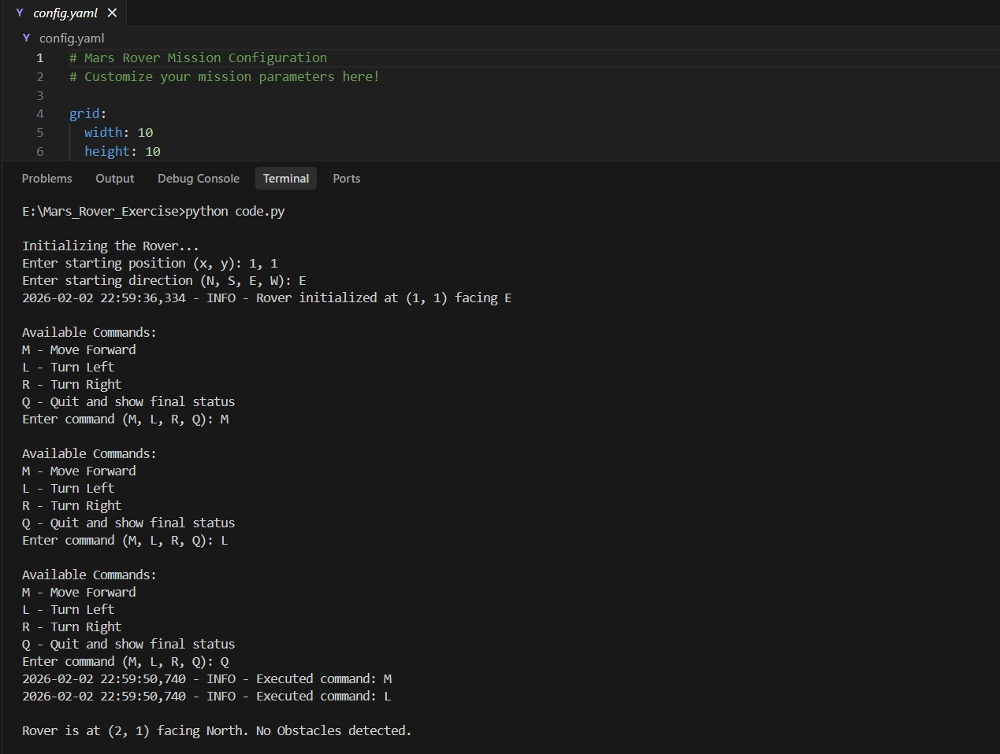
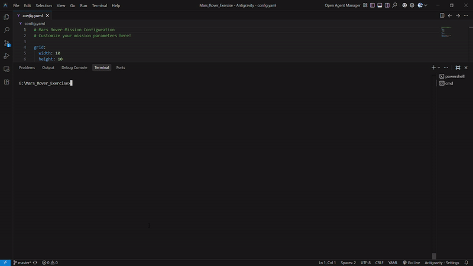

# 🚀 Mars Rover Simulation

A sophisticated command-line simulation of a Mars rover navigating a grid-based terrain with obstacles. Built using object-oriented programming principles, design patterns, and rich terminal visualization.

[](https://www.python.org/)
[](https://choosealicense.com/licenses/mit/)

---

## 🎬 Demo

Watch the Mars Rover in action!

### Basic Version (Code.py) - v0.0


### Enhanced Version with Rich UI (rover.py) - v1.0



---

## 📋 Table of Contents
1. [Features](#features)
2. [Project Structure](#project-structure)
3. [Getting Started](#getting-started)
4. [Usage](#usage)
5. [Architecture](#architecture)
6. [Configuration](#configuration)
7. [Testing](#testing)
8. [Design Patterns](#design-patterns)
9. [Contributing](#contributing)
10. [License](#license)

---

## ✨ Features

- **🎯 Grid-based Navigation**: Navigate a customizable grid with obstacle detection
- **🎨 Rich Terminal UI**: Beautiful command-line interface with colors and formatting (rover.py)
- **📝 Logging & Telemetry**: Comprehensive logging and mission telemetry tracking
- **⚙️ Configuration Support**: YAML-based configuration for easy mission customization
- **🧪 Comprehensive Testing**: Full test suite with pytest
- **🏗️ Design Patterns**: Strategy Pattern, Command Pattern, and Abstract Base Classes
- **📊 Status Reporting**: Real-time rover status and position tracking
- **🚧 Obstacle Avoidance**: Smart navigation that respects grid boundaries and obstacles

---

## 📁 Project Structure

```
Mars_Rover_Exercise/
├── Code.py                 # Basic implementation with simple CLI
├── rover.py                # Enhanced implementation with Rich UI
├── demo.py                 # Demo script
├── test_rover.py           # Comprehensive test suite
├── config.yaml             # Mission configuration file
├── requirements.txt        # Python dependencies
├── telemetry/              # Mission telemetry logs
├── README.md               # This file
└── .gitignore             # Git ignore rules
```

---

## 🚀 Getting Started

### Prerequisites
- Python 3.8 or higher
- pip (Python package manager)

### Installation

1. **Clone the repository**:
```bash
git clone https://github.com/your_username/Mars_Rover_Exercise.git
cd Mars_Rover_Exercise
```

2. **Install dependencies**:
```bash
pip install -r requirements.txt
```

The required packages are:
- `rich==13.7.0` - For beautiful terminal output
- `pyyaml==6.0.1` - For configuration file support
- `pytest==7.4.3` - For running tests

---

## 🎮 Usage

### Basic Version (Code.py)
Simple command-line interface with basic logging:

```bash
python Code.py
```

**Example interaction**:
```
Initializing the Rover...
Enter starting position (x, y): 0,0
Enter starting direction (N, S, E, W): N

Available Commands:
M - Move Forward
L - Turn Left
R - Turn Right
Q - Quit and show final status

Enter command (M, L, R, Q): M
Enter command (M, L, R, Q): M
Enter command (M, L, R, Q): R
Enter command (M, L, R, Q): M
Enter command (M, L, R, Q): Q

Rover is at (1, 2) facing East. No Obstacles detected.
```

### Enhanced Version (rover.py)
Rich terminal UI with configuration support and telemetry:

```bash
python rover.py
```

Features beautiful colored output, grid visualization, and automatic telemetry logging.

### Demo Script
Quick demonstration of rover capabilities:

```bash
python demo.py
```

---

## 🏗️ Architecture

### Class Hierarchy

```
┌─────────────────────────────────────────────────────────┐
│                    Direction (ABC)                      │
│  - move_forward(x, y) -> (x, y)                         │
│  - turn_left() -> Direction                             │
│  - turn_right() -> Direction                            │
└─────────────────────────────────────────────────────────┘
           ▲        ▲        ▲        ▲
           │        │        │        │
      ┌────┴───┬────┴───┬────┴───┬────┴────┐
      │ North  │  East  │ South  │  West   │
      └────────┴────────┴────────┴─────────┘

┌─────────────────────────────────────────────────────────┐
│                     Command (ABC)                       │
│  - execute(rover) -> None                               │
└─────────────────────────────────────────────────────────┘
           ▲        ▲        ▲
           │        │        │
      ┌────┴───┬────┴───┬────┴────┐
      │  Move  │  Turn  │  Turn   │
      │Forward │  Left  │  Right  │
      └────────┴────────┴─────────┘

┌─────────────────────────────────────────────────────────┐
│                        Grid                             │
│  - width: int                                           │
│  - height: int                                          │
│  - obstacles: List[Tuple[int, int]]                     │
│  + has_obstacle(x, y) -> bool                           │
└─────────────────────────────────────────────────────────┘

┌─────────────────────────────────────────────────────────┐
│                        Rover                            │
│  - x: int                                               │
│  - y: int                                               │
│  - direction: Direction                                 │
│  - grid: Grid                                           │
│  + move_forward() -> None                               │
│  + turn_left() -> None                                  │
│  + turn_right() -> None                                 │
│  + report_status() -> str                               │
└─────────────────────────────────────────────────────────┘
```

### Key Components

#### 1. **Direction Classes** (Strategy Pattern)
- `Direction` (ABC): Abstract base class defining direction behavior
- `North`, `East`, `South`, `West`: Concrete implementations
- Each direction knows how to move forward and turn

#### 2. **Command Classes** (Command Pattern)
- `Command` (ABC): Abstract base class for commands
- `MoveForward`, `TurnLeft`, `TurnRight`: Concrete commands
- Encapsulates rover actions as objects

#### 3. **Grid Class**
- Manages the terrain dimensions
- Tracks obstacle locations
- Validates rover movements

#### 4. **Rover Class**
- Maintains rover state (position, direction)
- Executes commands
- Validates movements against grid boundaries and obstacles

---

## ⚙️ Configuration

Edit `config.yaml` to customize your mission:

```yaml
grid:
  width: 10
  height: 10
  obstacles:
    - [2, 2]
    - [3, 5]
    - [7, 8]

rover:
  start_x: 0
  start_y: 0
  start_direction: "N"  # N, S, E, W

mission:
  name: "Mars Exploration Mission Alpha"
  enable_telemetry: true
  telemetry_folder: "telemetry"
```

---

## 🧪 Testing

Run the comprehensive test suite:

```bash
pytest test_rover.py -v
```

Run with coverage:

```bash
pytest test_rover.py --cov=rover --cov-report=html
```

The test suite covers:
- ✅ Direction class behavior
- ✅ Command execution
- ✅ Grid boundary validation
- ✅ Obstacle detection
- ✅ Rover movement and turning
- ✅ Edge cases and error handling

---

## 🎨 Design Patterns

### 1. **Strategy Pattern** (Direction Classes)
Different direction strategies encapsulate movement and turning logic without conditionals.

**Benefits**:
- Easy to add new directions
- No if-else chains
- Each direction is self-contained

### 2. **Command Pattern** (Command Classes)
Commands are encapsulated as objects, allowing for flexible execution and potential undo/redo functionality.

**Benefits**:
- Decouples command execution from rover logic
- Easy to add new commands
- Supports command queuing and history

### 3. **Abstract Base Classes**
Using Python's ABC module ensures proper interface implementation.

**Benefits**:
- Enforces contract compliance
- Prevents instantiation of incomplete classes
- Clear interface definitions

---

## 📊 Available Commands

| Command | Description | Example |
|---------|-------------|---------|
| `M` | Move forward one step | Moves rover in current direction |
| `L` | Turn left 90° | North → West → South → East |
| `R` | Turn right 90° | North → East → South → West |
| `Q` | Quit and show status | Displays final position |

---

## 🤝 Contributing

Contributions are welcome! Here's how you can help:

1. **Fork the repository**
2. **Create a feature branch**: `git checkout -b feature/amazing-feature`
3. **Commit your changes**: `git commit -m 'Add amazing feature'`
4. **Push to the branch**: `git push origin feature/amazing-feature`
5. **Open a Pull Request**

### Development Guidelines
- Follow PEP 8 style guidelines
- Add tests for new features
- Update documentation as needed
- Ensure all tests pass before submitting PR

---

## 📝 License

This project is licensed under the MIT License - see the [LICENSE](https://choosealicense.com/licenses/mit/) file for details.

---

## 🙏 Acknowledgments

- Built with Python's ABC module for robust OOP design
- Terminal UI powered by [Rich](https://github.com/Textualize/rich)
- Configuration management with PyYAML
- Testing framework: pytest

---

## 📧 Contact

For questions or suggestions, please open an issue on GitHub.

---

**Happy Mars Exploring! 🚀🔴**
